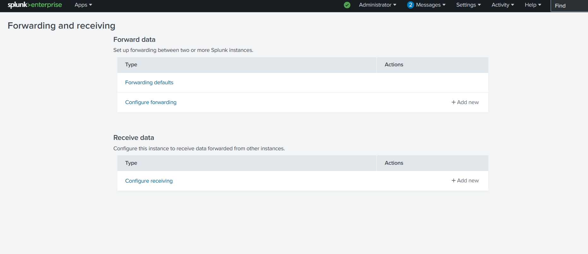
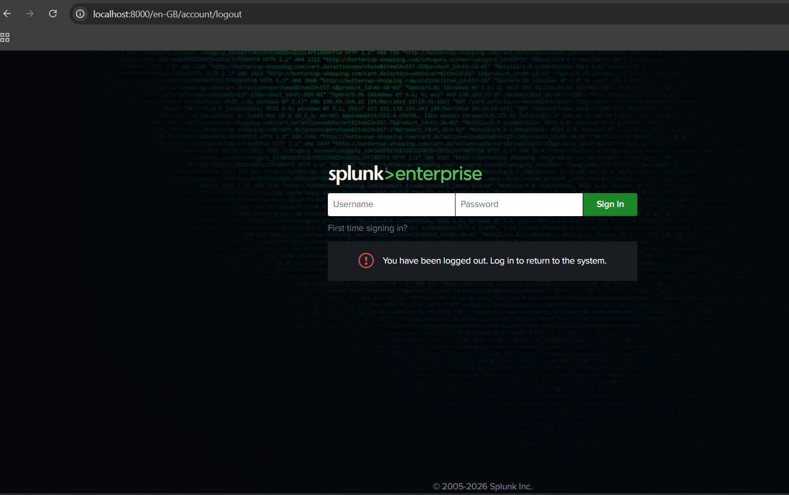
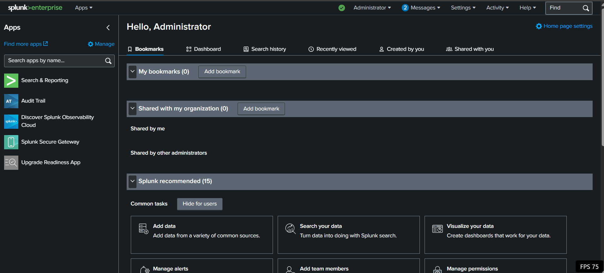

# 🔍 Splunk Enterprise Installation Guide

## Overview
This guide walks through installing and configuring Splunk Enterprise as the central SIEM for your home lab. Splunk will act as both the **Indexer** and **Search Head**, receiving logs from the Universal Forwarder running on your Windows 10 VM.

---

---

## Prerequisites

- **Host OS**: Windows 10/11 Pro or Enterprise
- **RAM**: Minimum 8GB (16GB recommended)
- **Disk Space**: 50GB free space
- **Port Availability**: 8000, 8089, 9997
- **Administrative Access**: Required for installation
- **Network**: Stable internet connection

---

## Download Splunk Enterprise

### Step 1: Create Splunk Account

1. Navigate to [Splunk Downloads](https://www.splunk.com/en_us/download/splunk-enterprise.html)
2. Click **"Sign In"** or create a new account
3. Verify your email address

### Step 2: Download Windows Installer

1. On the Downloads page, select your OS version (Windows 64-bit)
2. Accept the license agreement
3. Click **"Download"** button
4. Save the installer to your Desktop

---

## Installation Steps

### Step 1: Launch the Installer

1. **Right-click** the downloaded `.msi` file
2. Select **"Run as Administrator"**
3. Click **"Yes"** when prompted for UAC permission

### Step 2: Welcome Screen

1. Read the **Splunk License Agreement**
2. Check **"Accept the license agreement"** checkbox
3. Click **"Next"**

### Step 3: User Account Selection

**Option A: Default Service Account (Recommended)**
- Select **"Local System"** (default)
- Click **"Next"**

**Option B: Custom User Account**
- Select **"This user"**
- Enter username: `splunk_user`
- Enter password: (use strong password)
- Confirm password
- Click **"Next"**

### Step 4: Destination Folder

1. Default path: `C:\Program Files\Splunk`
2. **Keep default path** (recommended)
3. Click **"Next"**

### Step 5: Installation Summary

1. Review installation details
2. Click **"Install"** to proceed
3. Wait for installation to complete (2-5 minutes)

### Step 6: Completion

1. Check **"Start Splunk on startup"** (optional but recommended)
2. Click **"Finish"**
3. Windows may restart (save all work first)

---

## Initial Configuration

### Step 1: Access Splunk Web Interface

1. Open **Firefox** or **Chrome**
2. Navigate to: `https://localhost:8000`
3. **Ignore SSL warnings** and proceed (self-signed certificate)

### Step 2: Create Admin User

1. First login will prompt to create admin credentials
2. **Username**: `admin`
3. **Password**: Create strong password (minimum 8 characters)
4. Click **"Create"**

### Step 3: Home Dashboard

1. Accept the tour or skip it
2. You'll see the **Splunk Home** dashboard

## Port Configuration

### Verify Listening Ports

Splunk Enterprise uses multiple ports. Ensure they're available:

| Port | Purpose | Protocol |
|---|---|---|
| **8000** | Splunk Web Interface | HTTPS |
| **8089** | Splunk Management Port | HTTPS |
| **9997** | Receiving logs from Forwarders | TCP |

### 

apply port9997 as a receving port.